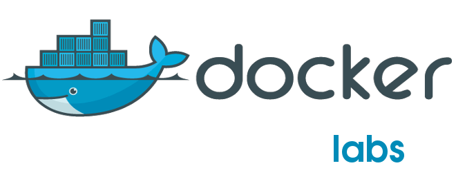
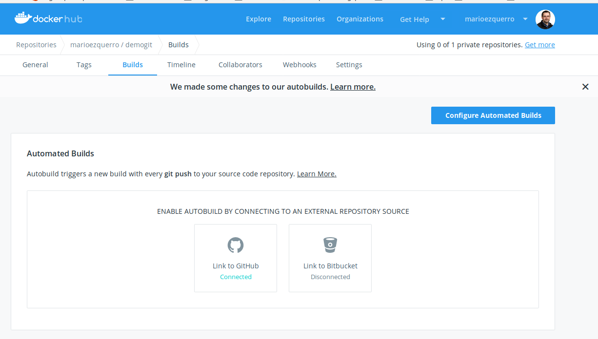

# Laboratorios

Estos labs están organizados por niveles, desde iniciados hasta avanzados, sistemas operativos, lenguaje de producción o perfil técnico. Muchos de ellos son totalmente interactivos, lo que facilita su realización.

 

## Laboratorios nivel iniciado en Docker:

+ [Introducción](https://training.play-with-docker.com/)
+ [Hello World (Developer Operations)](https://training.play-with-docker.com/ops-s1-hello/)
+ [First Alpine Linux Container (Linux Operations Developer)](https://training.play-with-docker.com/ops-s1-images/)
+ [Simple Web App (Linux Developer)](https://training.play-with-docker.com/beginner-linux/)
+ [Swarm stack introduction (Linux Operations)](https://training.play-with-docker.com/swarm-stack-intro/)
+ [Docker images deeper dive (Developer Operations Linux)](https://training.play-with-docker.com/docker-images/)
+ [Docker Volumes (LinuxDeveloper Operations)](https://training.play-with-docker.com/docker-volumes/)
+ [Swarm mode introduction (Linux Operations)](https://training.play-with-docker.com/swarm-mode-intro/)
+ [Docker compose with swarm secrets (Developer Operations Linux)](https://training.play-with-docker.com/swarm-compose-secrets/)
+ [Windows Containers Setup (Windows Operations Developer)](https://training.play-with-docker.com/windows-containers-setup/)
+ [Windows Containers Basics (Windows Operations Developer)](https://training.play-with-docker.com/windows-containers-basics/)
+ [Windows Containers Multi-Container Applications (Windows Operations Developer) ](https://training.play-with-docker.com/windows-containers-multicontainer/)

## Laboratorios nivel intermedio en Docker:

+ [Service Discovery under Docker Swarm Mode (Linux Operations)](https://training.play-with-docker.com/swarm-service-discovery/)
+ [Docker volume sshfs (Linux Operations Plugins Volumes)](https://training.play-with-docker.com/docker-volume-sshfs/)
+ [Swarm synchronous services (Linux Operations Swarm)](https://training.play-with-docker.com/synchronous-services/)
+ [WebApps with Docker Flow Proxy (Docker Webapp)](https://training.play-with-docker.com/docker-flow-proxy/)
+ [WebApps with Traefik LoadBalancing (Docker Webapp)](https://training.play-with-docker.com/traefik-load-balancing/)
+ [Multi-stage builds (Developer Operations)](https://training.play-with-docker.com/multi-stage/)
+ [Orchestration, part 1: from Compose to Swarm (Linux Developer Operations)](https://training.play-with-docker.com/orchestration-workshop-part1/)
+ [Orchestration, part 2: securing and operating Swarm (Linux Operations)](https://training.play-with-docker.com/orchestration-workshop-part2/)
+ [Docker networking (Docker Labs)](https://training.play-with-docker.com/docker-networking-hol/)
+ [Docker registry for Linux Part 1 (Linux Operations Developer)](https://training.play-with-docker.com/linux-registry-part1/)
+ [Docker registry for Linux Parts 2 & 3 (Linux Operations Developer)](https://training.play-with-docker.com/linux-registry-part2/)
+ [Go + Docker = ♥ (Linux Developer Golang)](https://training.play-with-docker.com/go-docker/)
+ [Live Debugging Node.js with Docker (Desktop Linux Windows Developer Nodejs)](https://training.play-with-docker.com/nodejs-live-debugging/)
+ [In-container Java Development: Netbeans (Desktop Linux Windows Developer Java)](https://training.play-with-docker.com/java-debugging-netbeans/)
+ [In-container Java Development: Intellij (Desktop Linux Windows Developer Java)](https://training.play-with-docker.com/java-debugging-intellij/)
+ [In-container Java Development: Eclipse (Desktop Linux Windows Developer Java)](https://training.play-with-docker.com/java-debugging-eclipse/)

## Laboratorios nivel avanzado en Docker:

+ [Security Lab: Capabilities (Linux Operations)](https://training.play-with-docker.com/security-capabilities/)
+ [Security Lab: Seccomp (Linux Operations)](https://training.play-with-docker.com/security-seccomp/)


# Basicos

docker run -d -p 82:82 --name webserver nginx

## Creación una imagen con el servidor web Apache2
´´´
$ mkdir apache
$ cd apache
~/apache$ echo "<h1>Prueba de funcionamiento contenedor docker</h1>">index.html
´´´

En ese directorio vamos a crear un fichero **Dockerfile**, con el siguiente contenido:
```
FROM debian
MAINTAINER Mario Ezquerro "mario.ezquerro@gmail.com"

RUN apt-get update && apt-get install -y apache2 && apt-get clean && rm -rf /var/lib/apt/lists/*

ENV APACHE_RUN_USER www-data
ENV APACHE_RUN_GROUP www-data
ENV APACHE_LOG_DIR /var/log/apache2

EXPOSE 80
ADD ["index.html","/var/www/html/"]

ENTRYPOINT ["/usr/sbin/apache2ctl", "-D", "FOREGROUND"]
```

Generamos la nueva imagen con el comando docker build con la opción -t indicamos el nombre de la nueva imagen (para indicar el nombre de la imagen es recomendable usar nuestro nombre de usuario en el registro docker hub, para posteriormente poder guardarlas en el registro), mandamos todos los ficheros del contexto (indicado con el punto). Podemos comprobar que tenemos generado la nueva imagen:

Vamos a generar la imagen:
```
~/apache$ docker build -t marioezquerro/apache2:1.0 .

$ docker images
 docker run -p 80:80 --name servidor_web marioezquerro/apache2:1.0

### Exportación/importación de imágenes
´´´
$ docker images 
$ docker save -o apache2.tar marioezquerro/apache2
$ docker load -i apache2.tar marioezquerro/apache2
```
### Guardando nuestras imágenes en docker hub
Para poder subir una imagen a nuestra cuenta de docker hub es necesario autentificarnos, para ello:
```
$ docker login
```
Y podemos subir nuestra imagen con el comando:
```
$ docker push marioezquerro/apache2
```
Podemos comprobar que la imagen se ha subido a docker hub:
```
$ docker search marioezquerro
```

## Creación una imagen con el servidor de base de datos mysql

Un directorio con los siguientes ficheros: Dockerfile  my.cnf  script.sh

El fichero de configuración de mysql, my.cnf:
```
[mysqld]
bind-address=0.0.0.0
console=1
general_log=1
general_log_file=/dev/stdout
log_error=/dev/stderr
```
Un script bash, que va a ser el que se va a ejecutar por defecto cunado se crea un contenedor, script.sh:

```
#!/bin/bash
set -e

chown -R mysql:mysql /var/lib/mysql
mysql_install_db --user mysql > /dev/null

MYSQL_ROOT_PASSWORD=${MYSQL_ROOT_PASSWORD:-""}
MYSQL_DATABASE=${MYSQL_DATABASE:-""}
MYSQL_USER=${MYSQL_USER:-""}
MYSQL_PASSWORD=${MYSQL_PASSWORD:-""}

tfile=`mktemp`
if [[ ! -f "$tfile" ]]; then
    return 1
fi

cat << EOF > $tfile
USE mysql;
FLUSH PRIVILEGES;
GRANT ALL PRIVILEGES ON *.* TO 'root'@'%' WITH GRANT OPTION;
UPDATE user SET password=PASSWORD("$MYSQL_ROOT_PASSWORD") WHERE user='root';
EOF

if [[ $MYSQL_DATABASE != "" ]]; then
    echo "CREATE DATABASE IF NOT EXISTS \`$MYSQL_DATABASE\` CHARACTER SET utf8 COLLATE utf8_general_ci;" >> $tfile

    if [[ $MYSQL_USER != "" ]]; then
        echo "GRANT ALL ON \`$MYSQL_DATABASE\`.* to '$MYSQL_USER'@'%' IDENTIFIED BY '$MYSQL_PASSWORD';" >> $tfile
    fi
fi

/usr/sbin/mysqld --bootstrap --verbose=0 < $tfile
rm -f $tfile

exec /usr/sbin/mysqld
```

El fichero Dockerfile tendrá el siguiente contenido:
```
FROM ubuntu:14.04 
MAINTAINER José Domingo Muñoz "josedom24@gmail.com"

RUN apt-get update && apt-get -y upgrade
RUN apt-get install -y mysql-server

ADD my.cnf /etc/mysql/conf.d/my.cnf 
ADD script.sh /usr/local/bin/script.sh
RUN chmod +x /usr/local/bin/script.sh

EXPOSE 3306

CMD ["/usr/local/bin/script.sh"]
```
Generamos la imagen:
```
$ docker build -t marioezquerro/mysql:1.0 .
```

Creamos un contenedor indicando la contraseña del root:
```
$ docker run -d -p 3306:3306 --env MYSQL_ROOT_PASSWORD=asdasd --name servidor_mysql marioezquerro/mysql:1.0
$ docker ps
$ mysql -u root -p -h localhost
```


## Creación una imagen con con php a partir de nuestra imagen con apache2

En este último ejemplo, vamos a crear una imagen con php5 a partir de nuestra imagen con apache: marioezquerro/apache2:1.0, para ello en el directorio php creamos un fichero **index.php**:
```
~/php$ echo "<?php echo phpinfo();?>">index.php
```
Y el fichero **Dockerfile**, con el siguiente contenido:
```
FROM marioezquerro:1.0
MAINTAINER Mario Ezquerro "mario.ezquerro@gmail.com"

RUN apt-get update && apt-get install -y php5 && apt-get clean && rm -rf /var/lib/apt/lists/*

EXPOSE 80
ADD ["index.php","/var/www/html/"]

ENTRYPOINT ["/usr/sbin/apache2ctl", "-D", "FOREGROUND"]
```

Generamos la nueva imagen:
```
~/php$ docker build -y marioezquerro/php5:1.0 .
```
Probando

$ docker run -d -p 8080:80 --name servidor_php marioezquerro/php5:1.0


# Generación automática de imágenes en docker hub

También podemos generar una imagen directamente en docker hub. Esta solución es mucho más cómoda, porque no es necesario generar la imagen en nuestro ordenador para posteriormente subirla al registro. Para realizar la generación automática vamos a guardar los ficheros de nuestro contexto (el fichero Dockerfile y los ficheros que vamos a guardar en la imagen) en un repositorio en GitHub.

Para realizar este ejemplo vamos a utilizar el ejemplo que hemos usado para crear la imagen con mysql. Lo primero que vamos a hacer es crear un repositorio en github donde vamos a guardar los ficheros:
```
mkdir github-dockerhub
cd github-dockerhub
ssh-keygen -t rsa -C "mario.ezquerro@gmail.com"
# copiar la /Users/your_user_directory/.ssh/id_rsa.pub en github -> 
# verificamos
ssh git@github.com
#
git init
# copiamos los ficheros
# tiene que estar el repositorio en github.
git add *
git config --global user.email "mario.ezquerro@gmail.com"
git config --global user.name "Mario Ezquerro"
git commit -m "Initial import"
git remote add origin git@github.com:wbugbofh/github-dockerhub.git
git push origin master
```

A continuación desde docker hub tenemos que crear un “Automated Build”:

La primera vez que lo hacemos tenemos que conectar docker con github y permitir que docker hub pueda acceder a nuestro repositorio, elegimos que nos vamos a conectar a github y seleccionamos la primera opción (Public and Private) donde permitamos más opciones de trabajo, finalmente desde github autorizamos a la aplicación docker hub. Para conseguir todo esto tenemos que seguir los siguiente pasos:





