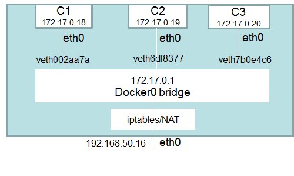

# Gestion de red en  Contendores

## Redes terminos basicos

- PAM: Gestión de direcciones IP. El problema de lagestión de direcciones IP no  es  exclusiva  de  los  contenedores.  Estos  servicios  existen  en  las  redes tradicionales (el servicio DHCP es un IPAM). El ámbito de losde contenedores, hay dos métodos principales de IPAM: Los segmentos de direcciones IP basadosen CIDR o la asignación de una IP a cada contenedor. La asignación de una IP única en un grupo de servidores de contenedores,  se  resuelve medianteIPAM.

- Overlay: Red separada superpuesta sobre los dos o tres niveles existentes. La red usualmente tendrá supropio espacio de direcciones IP independiente, y su propio    enrutamiento.

- IPSesc: un protocolo de comunicación encriptado de un punto a punto, usualmente usado en el canal de datos en la red Overlay

- vxLAN: Es una solución conjunta propuesta por VMware, Cisco, RedHat etc.,   principalmente  para  resolver  el  problema  de  que  la  red  virtual  VLAN  es demasiado pequeña (4096). Debido a que cada cliente en la nube pública tiene una VPC diferente, 4096 redes virtuales no es suficiente. vxLAN, puede soportar  hasta  16millones  de  redes  virtuales,  suficiente    para  una  nube pública.

- Bridge:La conexión de las dos redes entre el equipo de red. En el contexto de  este  trabajo  fin  de  máster  nos  referimos  a  Bridges  de  Linux,  y concretamente    Docker0.

- BGP:Protocolo de enrutamiento de red autónomo en la red de troncal.

## Configuración predeterminadas en Docker

Al instalar Docker, se configura automáticamente para usar la red 172.17.0.xx, el propio servidor docker es 172.17.0.1 y cada contenedor corriendo adquiere un IP posterior al último (172.17.0.2-254).

Al arrancar un contenedor podremos averiguar cual es la IP asignada con este comando, indicando al final el HASH del contenedor. En este caso nos dice 172.17.0.2.

```shell
$ docker inspect -f '{ {range.NetworkSettings.Networks } } { { .IPAddress } } { { end } }' 092d7808fec2
```




## Redes predeterminadas en Docker


$ docker network ls

- **Bridge**: La  red  bridge  representa  a  la  red  docker0  que  existe  en  todas  las instalaciones  de  Docker.  A  menos  que  use  docker  run -net=opción,  el daemon  de  Docker  conectará  el  contenedor  a  esta  red  de  forma predeterminada.  Usando  el  comando ifconfig en  el  host,  puede  verse  que este Bridge es parte de la pila de red del host.

    `$ docker run -d -P --net=bridge nginx:1.9.1`

    Inpeccionar la red bridge: `# docker network inspect bridge`

- **None**: La  red  agrega  un  contenedor  a  una  pila  de  red  específica  del contenedor sin conectarlo a ningún interfaz de red.  $ Docker network inspect none

    `$ docker run -d -P --net=none  nginx:1.9.1`
    `$ docker ps`
    `$ docker inspect <ID:docker> | grep IPAddress`

- **Host**: La  red  agrega  un  contenedor  a  la  pila  de  red  del  host.  Se  puede comprobar que la configuración de red en el contenedor es la misma que el host.

    `$ docker run -d --net=host ubuntu:14.04 tail -f /dev/null`
    `$ ip addr | grep -A 2 eth0:`
    `$ docker ps`
    `$ docker exec -it <id:docker> ip addr`
    
    Para inspeccionar la red host: `# docker network inspect host`
    
- **Overlay**:  Para el tipo overlay, necesitas trabajar en modo clúster. Si intentas crear una red de este tipo, sin estar en este modo, obtendrás el siguiente mensaje:

    ```shell
    $ docker network create --driver overlay multihost-net
    Error response from daemon: This node is not a swarm manager. Use "docker swarm init" or "docker swarm join" to connect this node to swarm and try again
    ```


- **Macvlan**: Existe un cuarto modo llamado macvlan que nos permite asignar IPs de una red a cada uno de los contenedores que viven en nuestro host. Sin embargo, para que este tipo de redes funcione necesitamos que la tarjeta de red del host esté en modo promiscuo, lo cual significa que necesita estar a la escucha de todos los paquetes que viajan por dicha red, simplemente para poder reconocer aquellos que potencialmente pueden ser para uno de sus contendores. Este modo muchas veces no está permitido en muchas organizaciones. La forma de configurar una red de este tipo sería así:

```
$ docker network create -d macvlan \
 --subnet=172.16.86.0/24 \
 --gateway=172.16.86.1 \
 -o parent=eth0 \
 my-macvlan-net
```


## Comando de red docker

Opciones del comando
​```shell
$ docker network --help
```

Crear una red de prueba de red
​```shell
$ sudo docker network create network-test
```
```shell
$ sudo docker network inspect test-network
```
Inicamos un  contenedor y lo conectamos a nuestra rede de pruebas
```shell
$ sudo docker run -itd --name=test1 --net=network-test busybox
```


Crearemos una red nueva, que se podrá usar para aislar ciertos contenedores, en este caso será la 172.19.0.xx

```shell
$ docker network create --driver bridge mi_re docker network create --driver bridge mi_re`d
```

A partir de crear nuevas redes, las podemos utilizar en contenedores, si arrancamos dos contenedores indicando que usen esa red con “–network xxx” ambos obtendrán un IP de ese rango (172.19.0.2 y 3) y se verán entre si.

```shell
$ docker run -d -P --name Contenedor_Nombre --network mi_red imagen_uno
```
#### Por ejemplo:
Correremos dos contenedores en la misma red standard ( bridge ).
```shell
S docker container run --name ubuntu1 ubuntu
S docker container run --name ubuntu2 ubuntu
```
Ahora conectaremos ambos contenedores a otra red creada manualmente (test), estaran conectada a la red default y a la red test.

```shell
$ docker network connect test ubuntu1
$ docker network connect test ubuntu2
```
Podemos desconectar esos contendore de la red:
```shell
$ docker network disconnect test ubuntu1
$ docker network disconnect test ubuntu2
``

También podemos borrar esa nueva red.

​```shell
$ docker network rm mi_red
```


## Linkear contenedores

Cuando se crea un nodo de contenedores es necesario que esos contenedores puedan conectarse entre sí por IP o por nombre de host. Pero como ya se dijo, si un contenedor se apaga al iniciarse nuevamente se generan nuevos parámetros como el ID y la IP que utiliza.

Para poder salvar este problema, existe la funcionalidad de «*linkear*«, enlazar, uno o más contenedores que permitirá que cada vez que uno de los contenedores enlazados se apague y se encienda, no importe la IP que el motor docker le asigne ya que se conectarán por el nombre de contenedor. Toda la magia necesaria la realiza el motor docker, como por ejemplo las reglas de ruteo, las reglas dns, etc.

Para poder enlazar contenedores se debe utilizar la variable «–link» al crear un contenedor con el comando 

`docker run -itd --link ID/contenedor01 --name contenedor01 -h contenedor02 ubuntu`

