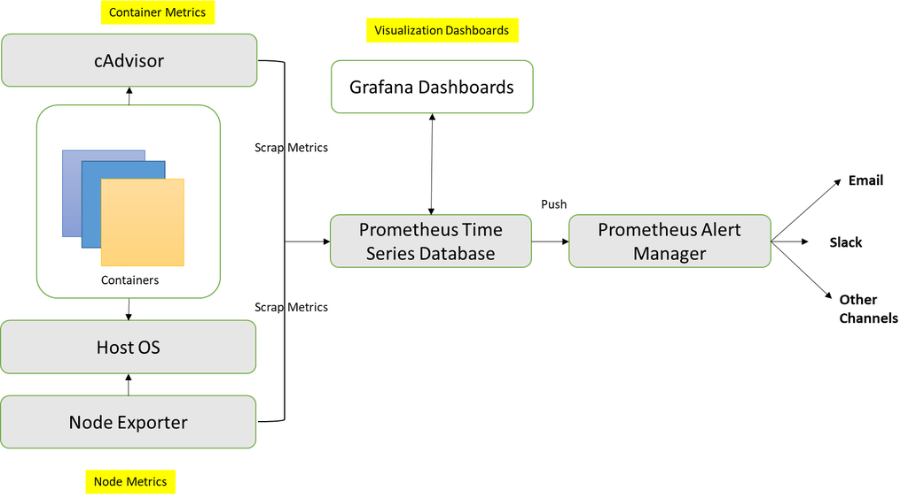

# Usamos Promotheus:


[CC](https://stefanprodan.com/2016/a-monitoring-solution-for-docker-hosts-containers-and-containerized-services/)

Activamos los siguentes contenedores
- tambien podemos pedirle a docker que nos de metricas.
- Podemos usar cAdvisor para recompilar informacion para los contenedores
- Tambien usando Prometheus Node Export para la gestion del NODO con mas metricas.
- Ademas necesitamos un fichero para Prometheus con la fonfiguracion de los server que monitoriza y como
- Configuracion del Alert Manager.
- Usamos Grafana para la visualizacion de todas las  funciones.

## Metricas desde docker

En /etc/docker/daemon.json

```
{
  "metrics-addr" : "127.0.0.1:9323",
  "experimental" : true
}
```
Y luego reiniciamos el Daemon de Docker.

Y para que prometheus puda trabajar con  esta configuracion la metemos en nuestra configuracion prometheus.yml (Ejemplo)
```
.............
scrape_configs:
  # The job name is added as a label `job=<job_name>` to any timeseries scraped from this config.

  - job_name: 'prometheus'
      target_groups:
          - targets: ['localhost:9090']

    - job_name: 'node-exporter'
      target_groups:
          - targets: ['node-exporter:9100']

    - job_name: 'cadvisor-exporter'
      scrape_interval: 1s
      target_groups:
	  - targets: ['cadvisor-exporter:9200']

    - job_name: 'Docker daemon'
      scrape_interval: 1s
      target_groups:
	  - targets: ['127.0.0.1:9323']
.............
```


## Configuracion de prometheus.yml

Cree una nueva configuración de Prometheus en un archivo llamado prometheus.yml. El servidor Prometheus requiere un archivo de configuración que defina los puntos finales para rastrear, junto con la frecuencia con la que se debe acceder a las métricas, y para definir los servidores y puertos de los que Prometheus debe raspar los datos.

En el siguiente ejemplo, hemos definido 3 server (el primero para Prometheus, el segundo para recopilar métricas de contenedores mediante el uso de cAdvisor y el último para las métricas de nodos que utilizan el exportador de nodos) que se ejecutan en diferentes puertos. [Más info aqui](https://prometheus.io/docs/operating/configuration)

```
scrape_configs:
- job_name: prometheus
scrape_interval: 5s
static_configs:
- targets:
- prometheus:9090

- job_name: cadvisor
scrape_interval: 5s
static_configs:
- targets:
- cadvisor:8081

- job_name: node-exporter
scrape_interval: 5s
static_configs:
- targets:
- node-exporter:9100

alerting:
alertmanagers:
- static_configs:
- targets: 
- alertmanager:9093

rule_files:
- 'alert.rules'
```


## Prepara el fichero Docker Compose Configuration

Cree un nuevo directorio de proyectos y prepare el archivo de composición de Docker como el que se muestra a continuación

#

```
version: '3'
services:
prometheus:
    image: 'prom/prometheus:v2.1.0'
    container_name: prometheus
    ports:
    - '9090:9090'
    command:
    - '--config.file=/etc/prometheus/prometheus.yml'
    - '--storage.tsdb.path=/prometheus'
    - '--web.console.libraries=/usr/share/prometheus/console_libraries'
    - '--web.console.templates=/usr/share/prometheus/consoles'
    volumes:
    - './prometheus.yml:/etc/prometheus/prometheus.yml:ro'
    - './alert.rules:/etc/prometheus/alert.rules'
    depends_on:
    - cadvisor
    networks:
    - samplenet
cadvisor:
    image: google/cadvisor
    container_name: cadvisor
    ports:
    - '8081:8081'
    volumes:
    - '/:/rootfs:ro'
    - '/var/run:/var/run:rw'
    - '/sys:/sys:ro'
    - '/var/lib/docker/:/var/lib/docker:ro'
    networks:
    - samplenet
alertmanager:
    image: prom/alertmanager
    ports:
    - '9093:9093'
    volumes:
    - './alertmanager/:/etc/alertmanager/'
    restart: always
    command:
    - '--config.file=/etc/alertmanager/config.yml'
    - '--storage.path=/alertmanager'
    networks:
    - samplenet
node-exporter:
    image: prom/node-exporter
    volumes:
     - '/proc:/host/proc:ro'
     - '/sys:/host/sys:ro'
     - '/:/rootfs:ro'
    command:
     - '--path.procfs=/host/proc'
     - '--path.sysfs=/host/sys'
     - '--collector.filesystem.ignored-mount-points'
     - ^/(sys|proc|dev|host|etc|rootfs/var/lib/docker/containers|rootfs/var/lib/docker/overlay2|rootfs/run/docker/netns|rootfs/var/lib/docker/aufs)($$|/)
    ports:
     - '9100:9100'
    networks:
     - samplenet
    restart: always
grafana:
    image: grafana/grafana
    depends_on:
    - prometheus
    ports:
    - '3000:3000'
    volumes:
    - 'grafana_data:/var/lib/grafana'
    - './grafana/provisioning/:/etc/grafana/provisioning/'
    env_file:
    - ./grafana/config.monitoring
    networks:
    - samplenet
    restart: always
volumes:
grafana_data: {}
prometheus_data: {}
```


## Alert Manager Configuracion
Alert Manager se encarga de desduplicar, agrupar y enrutar las alertas a la integración correcta del receptor, como correo electrónico, canales de inactividad, etc.

Vamos a hacer uso de la configuración predeterminada como ejemplo a continuación, crearemos una nueva carpeta alertmanager y pegaremos el archivo de configuración (config.yml)

```
route:
   receiver: 'slack'

receivers:
   - name: 'slack'
      slack_configs:
      - send_resolved: true
      username: '<username>'
      channel: '#<channel-name>'
      api_url: '<incomming-webhook-url>'
```

## Configuracion de Grafana

Grafana sería la herramienta de visualización de "pizarras" de mandos elegida por los usuarios de Prometheus y el soporte para los Docker de Grafana con la herramienta. Para supervisar los contenedores de Docker, vamos a importar dashboard de mandos pre-construidos desde Grafana.com.

Cree una nueva carpeta de Grafana y copie el contenido de la fuente para automatizar el aprovisionamiento de fuentes de datos y paneles. Para obtener las instrucciones de instalación de Grafana completas, consulte la documentación [oficial de Grafana](http://docs.grafana.org/installation/).

## Para funcionar con todo:

Iniciar la composición de Docker utilizando:
	
	docker-compose up -d

Una vez que todos los contenedores estén listos, Prometheus ahora raspará y almacenará los datos según la configuración. Prometheus está configurado en el puerto 9090, vaya al panel de control [http://localhost:9090](http://localhost:9090) y verifique que Prometheus ahora tenga información sobre la información de la serie de tiempo en los contenedores, nodo.

Grafana escuchará en [http://localhost:3000](http://localhost:3000). El inicio de sesión predeterminado es "admin" / "admin", una vez que inicie sesión, use la opción "Filtro" para navegar por los paneles de control. De la lista, elija "Docker Prometheus Monitoring" para verlo.


Si desea modificar Dashboard o fuente de datos, debe editar manualmente los archivos JSON descargados y corregir las entradas de fuente de datos: para reflejar el nombre de la fuente de datos de Grafana que eligió para su servidor Prometheus. Use la opción “Tableros” → “Inicio” → “Importar” para importar el archivo del tablero editado en su instalación de Grafana.


