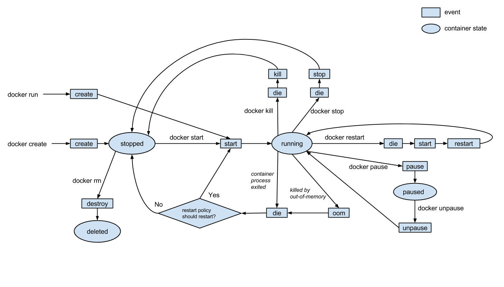

### Estado de los contenedores en Docker

Los contenedores cuando están funcionando sin problemas nos indicará, que llevan UP tanto tiempo. En cambio, si no están disponibles nos mostrarám uno de estos estados: `**exited, unhealthy, dead o create.**`

¿Cómo podemos ver esta información? Fácil, solo hemos de utilizar el comando `docker ps`, que nos mostrará una lista similar a esta con los contenedores que tengamos disponibles:


En la columna «STATUS» observamos su estado. En esta vista todos los contenedores están disponibles, si queremos también ver los que no están disponibles, escribimos:`**docker ps -a**`, con el resultado:


- **Created**: Esto significa que el contenedor se esta creando. Depende del caso puede que este quede en un bucle, intentando crearse «*in eternum*«
- **Restarting**: El contenedor se está reiniciando.
- **Running**: El contenedor está funcionando.
- **Removing**: El contenedor se esta elimiando.
- **Paused**: El contenedor se encuentra en estado pausado.
- **Unhealthy**: Si una sola ejecución de un comando lleva más tiempo que el tiempo de espera especificado, entonces se considerará en ese estado. Tras intentar la ejecución en diferentes ocasiones.
- **Exited**: El proceso principal ha indicado «exit», por lo que este esta «apagado»
- **Dead**: Los contenedores están en un estado difunto, generalmente debido a problemas para acceder a su almacenamiento subyacente

También podemos filtrar únicamente los contenedores que tienen un estado diferente a «**Running**» o «**UP**«, por ejemplo:

```
sudo docker ps -a | egrep "unhealthy|Created|Dead"
```

Si queremos saber más e indagar porque un contenedor no está funcionando correctamente, podemos utilizar `**docker logs -contenedor-**`, o para saber como esta montado `**docker inspect -contenedor-**`


### **Diagrama de Flujo**

